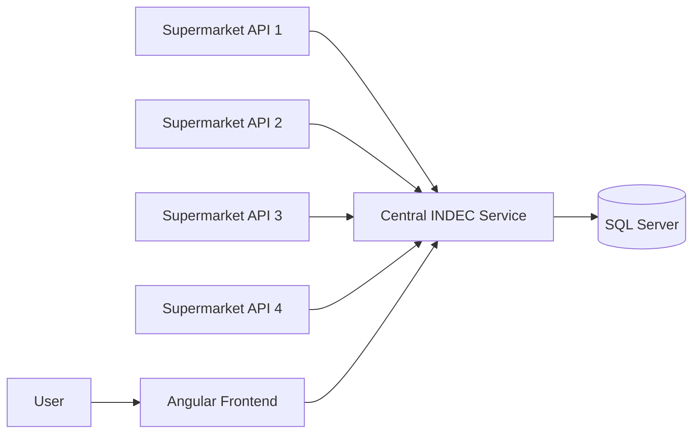

# Price Comparator Platform

Full-stack price comparison platform built with Java, Spring Boot, Angular and SQL Server.

This project was developed as a final project for Advanced Software Design at Universidad Blas Pascal. It simulates a platform where users can compare prices for essential goods across multiple supermarkets and find the most affordable option based on their selected location.

## Overview

The application allows users to browse products, add items to a virtual shopping cart, select their province and locality, and compare prices across different supermarkets.

It also includes supermarket branch information and daily price update processes, simulating how multiple supermarket systems could publish product and branch data to a central platform.

## Key features

* Product browsing by category
* Virtual shopping cart
* Price comparison across supermarkets
* Lowest-price highlighting
* Province and locality filtering
* Supermarket branch information
* Daily product and price update processes
* Spanish and English frontend support
* Responsive Angular UI
* REST and SOAP service integration
* Token-based service authentication

## Tech stack

### Backend

* Java
* Spring Boot
* Maven
* REST APIs
* SOAP services
* SQL Server

### Frontend

* Angular
* TypeScript
* HTML / CSS

### Database

* SQL Server
* Separate databases for INDEC and supermarket systems

## Architecture

The system is organized around a central INDEC service and multiple supermarket services.

Each supermarket publishes product, branch and price information. The central platform consumes that information and exposes it to the frontend so users can compare prices by location.



## Main user flow

1. User selects a province and locality.
2. User browses available products.
3. User adds products to a virtual cart.
4. The system compares prices across supermarkets.
5. The frontend displays a comparison table and highlights the cheapest option.

## Setup

### Prerequisites

* Java 11+
* Maven
* Node.js
* Angular CLI
* SQL Server 2019+
* npm

### Clone the repository

```bash
git clone https://github.com/laralopez17/price_comparator.git
cd price_comparator
```

### Database setup

The project uses multiple SQL Server databases:

* One central database for INDEC
* One database for each supermarket service

Database scripts are included in the repository to create the required tables and stored procedures.

You will need to configure database connection values and API keys in each backend service.

Example configuration:

```properties
spring.datasource.url=jdbc:sqlserver://localhost:1433;databaseName=super4;encrypt=false
spring.datasource.username=your_user
spring.datasource.password=your_password
api.security.key=your_api_key
```

### Backend setup

Each backend service is a Maven project.

From the corresponding backend folder, install dependencies:

```bash
mvn install
```

Then run the required Spring Boot services.

### Frontend setup

```bash
cd frontend
npm install
```

Run the frontend in Spanish:

```bash
npm run start-es
```

Run the frontend in English:

```bash
npm run start-en
```

## Project structure

```text
backend/
  IndecRest/
  Super1/
  Super2/
  Super3/
  Super4/

frontend/
  Angular application

database scripts/
  SQL Server setup scripts
```

Adjust folder names above if the repository structure changes.

## Screenshots

* Product browsing


* Shopping cart
  

* Price comparison table
  

* Branch location information
  


## What this project demonstrates

* Java / Spring Boot backend development
* Angular frontend development
* SQL Server database design
* REST and SOAP service integration
* Multi-service architecture
* Token-based API security
* Full-stack software design
* Functional and non-functional requirements analysis

## Limitations

This was an academic project and is not production deployed.

Potential improvements:

* Docker Compose setup for all services
* Centralized configuration
* Automated database seed scripts
* Integration tests
* CI pipeline
* Improved API documentation
* Cloud deployment

## Status

Academic full-stack project. Public for portfolio purposes.
